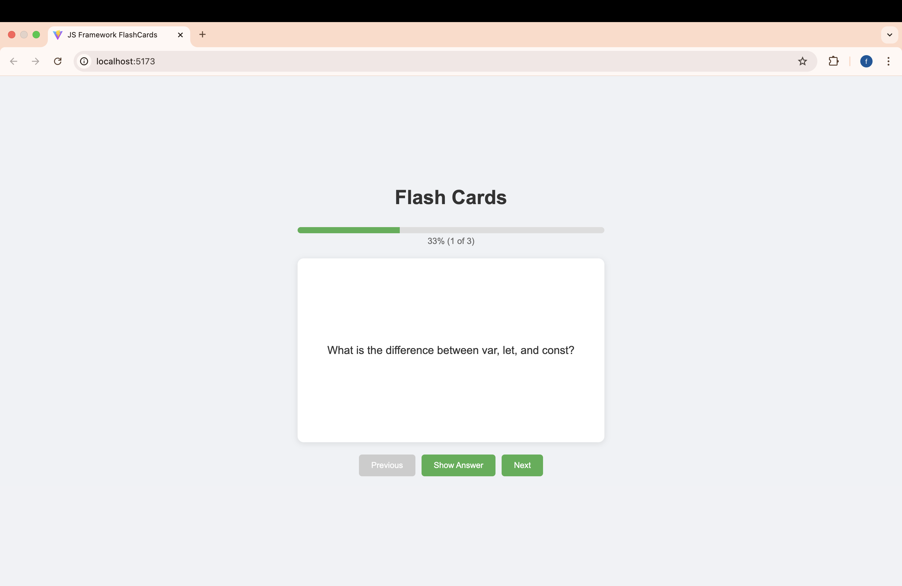

# JavaScript FrameWork Flash Cards

An interactive flash card application built with React, focusing on JavaScript concepts. This project is part of the frontend learning path from [roadmap.sh](https://roadmap.sh/frontend).

## Live Demo
[View Demo](https://faizaazam-1.github.io/FlashCards/)

## Preview

## Features
- Interactive flash cards with questions and answers
- Smooth flip animation for card reveals
- Progress tracking with percentage
- Navigation between cards
- Clean and modern UI
- Responsive design

## Built With
- React
- Vite
- CSS3 for animations and styling

## Project Structure
